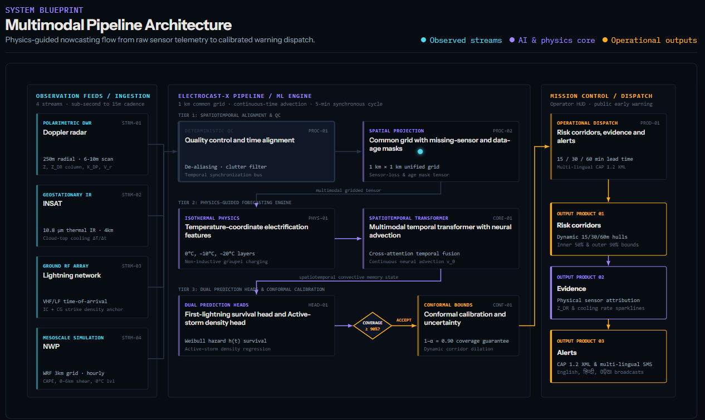

# ElectroCast-X — Lightning Mission Control

A physics-guided multimodal lightning nowcasting system that answers **when** a developing cloud will first produce lightning, **where** an active storm will go, and **how far to trust it and why**, 15, 30, and 60 minutes ahead.

Built for **SIH PS26072** as a single operational workstation over **Odisha**.

---

## The idea

Lightning is the deadliest natural hazard in Odisha, claiming over 1,600 lives across five years—predominantly agricultural and outdoor workers given only minutes of warning. Conventional nowcasting forces forecasters to choose between optical lightning detection networks that only trigger *after* strikes occur, and black-box deep learning models that blur storm cells into unphysical dissipation or crash when coastal radar disconnects.

ElectroCast-X bridges that gap. By anchoring temporal transformers to non-inductive charging physics in the mixed-phase zone (−10 °C to −20 °C) and wrapping predictions in finite-sample conformal uncertainty bounds, the system provides duty forecasters with actionable lead times, physical evidence sparklines, and automated multi-lingual CAP 1.2 alerts.

## What ElectroCast-X does today

- **First-Lightning Initiation (Survival Head)**: Predicts the continuous hazard rate $h(t)$ and 15/30/60-minute initiation probability for pre-convective cumulus clouds 15–30 minutes before the first ground strike.
- **Active Severe Storm Tracking (Density Head)**: Tracks mature convective squalls using neural advection vector fields, flash density trends ($\text{fl}/\text{km}^2/\text{min}$), and cell morphology preservation.
- **Counterfactual Sensor Lab**: Tests model resilience by dynamically toggling Doppler radar, INSAT-3D, lightning RF, or NWP feeds, observing how the conformal quantile mathematically dilates the corridor without crashing.
- **3D Storm Digital Twin (X-Ray)**: Slices volumetric Doppler radar in temperature coordinates (0 °C freezing level, −10 °C mixed-phase, −20 °C dipole) to inspect $Z_{\text{DR}}$ columns, $K_{\text{DP}}$ cores, and graupel distribution.
- **Multi-Lingual Alert Composer**: Synthesizes verified forecast hulls into CAP 1.2 XML, SMS, and lockscreen notifications in English, हिन्दी, and ଓଡ଼ିଆ.
- **Storm Time Machine**: Scrubs from −60 to +60 minutes with keyframe ticks, variable playback speed, and a split-screen **Prediction vs. Actual** swipe divider.

## Core principles

### Physics before prediction
Flash detection alone is too late. ElectroCast-X monitors the non-inductive charging zone where graupel and supercooled water collide, detecting polarimetric $Z_{\text{DR}}$ column growth and satellite cloud-top cooling ($\le -1.5\text{ }^\circ\text{C}/\text{min}$) before the first spark.

### Conformal guarantees over black-box confidence
Rather than outputting uncalibrated neural probabilities, the system applies split-conformal calibration ($1 - \alpha = 0.90$). When coastal radar suffers beam blockage or downtime, the risk corridor mathematically widens to protect public safety.

### Operator evidence over generic AI copy
Every alert and recommendation is backed by auditable meteorological indicators (echo top height, $Z_{\text{DR}}$ column altitude, freezing level, CAPE, and shear). No generated text invents a number.

---

## How it works



Asynchronous telemetry from Doppler radars (Paradip & Gopalpur), INSAT-3D thermal IR, ground VHF/LF lightning networks, and WRF mesoscale NWP streams into a deterministic quality-control bus. Observations are aligned onto a unified $1\text{ km} \times 1\text{ km}$ Euclidean grid alongside missing-sensor and data-age mask tensors. 

A multimodal spatiotemporal transformer with continuous neural advection evaluates mixed-phase electrification features, feeding decoupled survival and density heads. Calibrated uncertainty envelopes are rasterized into 15/30/60-minute risk corridors and dispatched via CAP 1.2 protocols in under 60 seconds.

---

## The three operational scenarios

| Scenario | Regime | Location | Narrative |
|---|---|---|---|
| **Scenario A** | First-Lightning Initiation | Mayurbhanj–Keonjhar | A developing convective cell intensifies; the countdown chronometer signals high initiation risk 25 minutes prior to first breakdown. |
| **Scenario B** | Active Severe Squall | Keonjhar → Balasore | An electrified squall line advances toward coastal population corridors with surging strike density and neural advection tracking. |
| **Scenario C** | Sensor Failure & Resilience | Cuttack–Khordha | Paradip radar hardware drops out at −10 min; the pipeline sustains forecasts on satellite and NWP, dilating the corridor via conformal bounds. |

---

## Built with

- **Next.js 16** (Static Export, zero runtime server dependencies) & **React 19**
- **TypeScript** (Strict mode) & **Tailwind CSS v4** (Custom radar/mission tokens)
- **Zustand** (Single immutable state machine) & **Motion** (`LazyMotion` + `m.*`)
- **Canvas 2D + d3-geo** (High-performance 60 fps tactical radar map)
- **Three.js & React Three Fiber** (Lazy-loaded 3D storm volumetric digital twin)
- **Apache ECharts** (Lazy-loaded validation and reliability diagrams)
- **Fontsource** (Bundled offline Instrument Sans & IBM Plex Mono)

---

## Run locally

Prerequisites: Node.js 20+ and npm.

```bash
# Clone and install dependencies
git clone https://github.com/ijatinydv/ElectroCast-X.git
cd ElectroCast-X
npm install

# Start development workstation
npm run dev

# Run full engineering verification suite (typecheck + vitest + data invariants + build)
npm run verify

# Build and serve offline static export
npm run build
npm run serve
```

Open [http://localhost:3000](http://localhost:3000) to view Mission Control.

